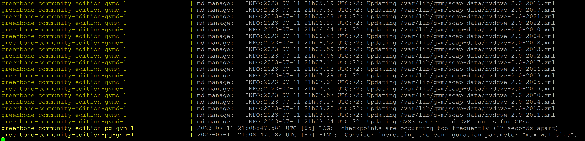

# OPENVAS

Prérequis :

Cette procédure à été testée depuis une machine sous (Debian 12) avec Docker d’installé et docker-compose.

Vous trouverez ici un tutoriel sur l’installation de Docker, Docker-compose & Portainer.

- Installation manuelle de Docker, [disponible ici](https://github.com/0xCyberLiTech/Docker/blob/main/README.md#installation-manuelle-de-docker)

- Installation manuelle de Docker-compose, [disponible ici](https://github.com/0xCyberLiTech/Docker/blob/main/README.md#installation-manuelle-de-docker-compose)

- Installation manuelle de Portainer, [disponible ici](https://github.com/0xCyberLiTech/Docker/blob/main/README.md#mise-%C3%A0-jour-manuelle-de-portainer)

Conditions préalables :

- Note.

Si vous avez installer une DEBIAN 12 de base, (sudo) n'est pas installé.

Procéder à l'installation de celui-ci.

```
su - root
apt install sudo
adduser cyberlitech sudo
init 6
```
Se connecter au terminal, avec le user (ex, cyberlitech).

Veuillez suivre le guide étape par étape.

Les étapes ultérieures peuvent nécessiter des paramètres ou sortie d’une commande précédente.

La commande sudo est utilisée pour exécuter des commandes qui nécessitent un privilège accès sur le système.

- Installer curl :

Curl est requis pour télécharger des fichiers à partir de ce guide.
```
sudo apt install curl
```
<a name="balise_01"></a>
Ajouter l’utilisateur actuel au groupe docker et appliquer les modifications de groupe pour l’environnement shell actuel.
```
sudo usermod -aG docker $USER && su $USER
```
Pour télécharger le fichier de composition docker Greenbone Community Edition, un Le répertoire de destination doit être créé.

Créer un répertoire de téléchargement.
```
mkdir ~/greenbone-community-container/
```
Fichier de composition Docker.

Pour exécuter Greenbone Community Edition avec des conteneurs, les éléments suivants sont composés doit être utilisé:

Fichier de composition Docker.
```
services:
  vulnerability-tests:
    image: greenbone/vulnerability-tests
    environment:
      STORAGE_PATH: /var/lib/openvas/22.04/vt-data/nasl
    volumes:
      - vt_data_vol:/mnt

  notus-data:
    image: greenbone/notus-data
    volumes:
      - notus_data_vol:/mnt

  scap-data:
    image: greenbone/scap-data
    volumes:
      - scap_data_vol:/mnt

  cert-bund-data:
    image: greenbone/cert-bund-data
    volumes:
      - cert_data_vol:/mnt

  dfn-cert-data:
    image: greenbone/dfn-cert-data
    volumes:
      - cert_data_vol:/mnt
    depends_on:
      - cert-bund-data

  data-objects:
    image: greenbone/data-objects
    volumes:
      - data_objects_vol:/mnt

  report-formats:
    image: greenbone/report-formats
    volumes:
      - data_objects_vol:/mnt
    depends_on:
      - data-objects

  gpg-data:
    image: greenbone/gpg-data
    volumes:
      - gpg_data_vol:/mnt

  redis-server:
    image: greenbone/redis-server
    restart: on-failure
    volumes:
      - redis_socket_vol:/run/redis/

  pg-gvm:
    image: greenbone/pg-gvm:stable
    restart: on-failure
    volumes:
      - psql_data_vol:/var/lib/postgresql
      - psql_socket_vol:/var/run/postgresql

  gvmd:
    image: greenbone/gvmd:stable
    restart: on-failure
    volumes:
      - gvmd_data_vol:/var/lib/gvm
      - scap_data_vol:/var/lib/gvm/scap-data/
      - cert_data_vol:/var/lib/gvm/cert-data
      - data_objects_vol:/var/lib/gvm/data-objects/gvmd
      - vt_data_vol:/var/lib/openvas/plugins
      - psql_data_vol:/var/lib/postgresql
      - gvmd_socket_vol:/run/gvmd
      - ospd_openvas_socket_vol:/run/ospd
      - psql_socket_vol:/var/run/postgresql
    depends_on:
      pg-gvm:
        condition: service_started
      scap-data:
        condition: service_completed_successfully
      cert-bund-data:
        condition: service_completed_successfully
      dfn-cert-data:
        condition: service_completed_successfully
      data-objects:
        condition: service_completed_successfully
      report-formats:
        condition: service_completed_successfully

  gsa:
    image: greenbone/gsa:stable
    restart: on-failure
    ports:
      - 9392:80
    volumes:
      - gvmd_socket_vol:/run/gvmd
    depends_on:
      - gvmd

  ospd-openvas:
    image: greenbone/ospd-openvas:stable
    restart: on-failure
    init: true
    hostname: ospd-openvas.local
    cap_add:
      - NET_ADMIN # for capturing packages in promiscuous mode
      - NET_RAW # for raw sockets e.g. used for the boreas alive detection
    security_opt:
      - seccomp=unconfined
      - apparmor=unconfined
    command:
      [
        "ospd-openvas",
        "-f",
        "--config",
        "/etc/gvm/ospd-openvas.conf",
        "--mqtt-broker-address",
        "mqtt-broker",
        "--notus-feed-dir",
        "/var/lib/notus/advisories",
        "-m",
        "666"
      ]
    volumes:
      - gpg_data_vol:/etc/openvas/gnupg
      - vt_data_vol:/var/lib/openvas/plugins
      - notus_data_vol:/var/lib/notus
      - ospd_openvas_socket_vol:/run/ospd
      - redis_socket_vol:/run/redis/
    depends_on:
      redis-server:
        condition: service_started
      gpg-data:
        condition: service_completed_successfully
      vulnerability-tests:
        condition: service_completed_successfully

  mqtt-broker:
    restart: on-failure
    image: greenbone/mqtt-broker
    ports:
      - 1883:1883
    networks:
      default:
        aliases:
          - mqtt-broker
          - broker

  notus-scanner:
    restart: on-failure
    image: greenbone/notus-scanner:stable
    volumes:
      - notus_data_vol:/var/lib/notus
      - gpg_data_vol:/etc/openvas/gnupg
    environment:
      NOTUS_SCANNER_MQTT_BROKER_ADDRESS: mqtt-broker
      NOTUS_SCANNER_PRODUCTS_DIRECTORY: /var/lib/notus/products
    depends_on:
      - mqtt-broker
      - gpg-data
      - vulnerability-tests

  gvm-tools:
    image: greenbone/gvm-tools
    volumes:
      - gvmd_socket_vol:/run/gvmd
      - ospd_openvas_socket_vol:/run/ospd
    depends_on:
      - gvmd
      - ospd-openvas

volumes:
  gpg_data_vol:
  scap_data_vol:
  cert_data_vol:
  data_objects_vol:
  gvmd_data_vol:
  psql_data_vol:
  vt_data_vol:
  notus_data_vol:
  psql_socket_vol:
  gvmd_socket_vol:
  ospd_openvas_socket_vol:
  redis_socket_vol:
```
Description.

Le tableau suivant décrit les conteneurs fournis du fichier de composition docker et leurs services en détail.

| Conteneur |  Service |  Description    |
|-----------|----------|-----------------|
| redis-serveur | Serveur Redis | Un serveur redis avec une configuration ajustée. Utilisé pour stocker les données VT et numériser les résultats par le scanner. |
| pg-gvm | PostgreSQL | Une configuration de cluster de base de données PostgreSQL à utiliser avec gvmd. Les données réelles sont stockées dans le volume.psql_data_vol |
| gvmd | gvmd | Conteneur pour gvmd qui utilise des sockets unix dans les volumes pour communiquer avec la base de données PostgreSQL et l’analyseur ospd-openvas. Les données de flux téléchargées sont stockées dans le volume. Pour vérifier les données d’alimentation, le trousseau de clés GPG du est utilisé.gvmd_data_volgpg_data_vol |
| gsa | gsad | Conteneur exécutant le serveur Web gsad pour fournir l’application Web GSA. L’interface Web est disponible sur localhost sur le port 9392. Pour la communication avec gvmd, un socket unix dans un volume est utilisé. |
| ospd-openvas | ospd-openvas | Un conteneur fournissant le scanner de vulnérabilité. Les données VT du flux sont stockées dans le volume. Pour vérifier les données d’alimentation, le trousseau de clés GPG du est utilisé. La connexion au serveur redis est établie via un socket unix dans un volume.vt_data_volgpg_data_vol |
| mqtt-broker | Mosquitto MQTT Broker | Un MQTT Broker utilisé pour la communication entre notus-scanner, openvas-scanner et ospd-openvas. |
| notus-scanner | notus-scanner | Conteneur exécutant le scanner notus utilisé pour les contrôles de sécurité locaux. Pour vérifier les données d’alimentation, le trousseau de clés GPG du est utilisé. Les données d’alimentation pour notus-scanner lui-même sont stockées dans le fichier .gpg_data_volnotus_data_vol |
| gvm-tools |  | Un conteneur fournissant l’interface de ligne de commande gvm-tools pour interroger et contrôler gvmd et ospd-openvas. |
| gpg-data  |  | Conteneur qui copie un trousseau de clés GPG avec les clés de signature publiques de Greenbone dans le volume au démarrage. Il sort après.gpg_data_vol |
| vulnerability-tests |  | Conteneur qui copie les tests de vulnérabilité (VT) dans le volume au démarrage. Affiche la licence et se ferme par la suite.vt_data_vol |
| notus-data |  | Conteneur qui copie les informations de vulnérabilité de notus-scanner dans le volume au démarrage. Affiche la licence et se ferme par la suite.notus_data_vol |
| scap-data  |  | Conteneur qui copie les données CVE et CPE dans le volume au démarrage. Affiche la licence et se ferme par la suite.scap_data_vol |
| cert-bund-data |  | Conteneur qui copie les données CERT-Bund dans le volume au démarrage. Affiche la licence et se ferme par la suite.cert_data_vol |
| dfn-cert-data |  | Conteneur qui copie les données DFN-CERT dans le volume au démarrage. Affiche la licence et se ferme par la suite.cert_data_vol |
| data-objects |  | Conteneur qui copie les configurations d’analyse, les stratégies de conformité et les listes de ports dans le volume au démarrage. Affiche la licence et se ferme par la suite.data_objects_vol |
| report-formats |  | Conteneur qui copie les formats de rapport dans le volume au démarrage. Affiche la licence et se ferme par la suite.data_objects_vol |

Lancement des conteneurs communautaires Greenbone.

À l’aide du fichier docker compose, les images du conteneur peuvent être téléchargées (extraites) et les conteneurs peuvent être démarrés en arrière-plan.

Téléchargement des conteneurs communautaires Greenbone.
```
cd ~/greenbone-community-container/
```
```
curl -f -L https://greenbone.github.io/docs/latest/_static/docker-compose-22.4.yml -o docker-compose.yml
```


Lancement des conteneurs communautaires Greenbone.
```
docker-compose -f docker-compose.yml -p greenbone-community-edition up -d
```


Pour obtenir un flux continu de la sortie du journal de tous les services, exécutez la commande suivante commander:

Afficher les messages de journal de tous les services à partir des conteneurs en cours d’exécution.
```
docker-compose -f docker-compose.yml -p greenbone-community-edition logs -f
```


Le flux de journaux peut être arrêté en appuyant sur . Ctrl + c

Configuration d’un utilisateur administrateur.

Avertissement :

Par défaut, un administrateur utilisateur avec le mot de passe admin est créé. 

Ce n’est pas sûr Et il est fortement recommandé de définir un nouveau mot de passe.

Pour mettre à jour l’utilisateur administrateur avec un mot de passe de votre choix au lieu du mot de passe généré, la commande suivante peut être utilisée :

Mise à jour du mot de passe de l’utilisateur administrateur.
```
docker-compose -f docker-compose.yml -p greenbone-community-edition \
    exec -u gvmd gvmd gvmd --user=admin --new-password=admin
```
Démarrage de la gestion des vulnérabilités.

Une fois que les services ont démarré et que toutes les données de flux ont été chargées, l’interface Web de Greenbone Security Assistant – GSA – peut être ouverte dans le navigateur.

Ouverture de Greenbone Security Assistant dans le navigateur.
```
xdg-open "http://127.0.0.1:9392" 2>/dev/null >/dev/null &
```
Le navigateur affichera la page de connexion de GSA et après avoir utilisé les informations d’identification Créé auparavant, il est possible de commencer par l’analyse des vulnérabilités.


# Dépannage :

Avertissement.

Les commandes des instructions de dépannage suivantes ne sont valides que si vous a suivi la documentation de génération source. Si vous avez installé le Greenbone Community Edition via une distribution Linux (par exemple Kali Linux), le Les commandes peuvent être légèrement différentes et doivent être ajustées.

Faire face à un problème avec l’édition Greenbone Community.

Si vous avez un problème avec Greenbone Community Edition parce que quelque chose ne fonctionne pas comme prévu et/ou vous obtenez une erreur dans l’interface utilisateur Web Il est nécessaire de vérifier les fichiers journaux pour obtenir des conseils techniques sur le problème.

Si quelque chose ne fonctionne pas pendant l’analyse, les fichiers et doivent être vérifiés pour les erreurs.
```
/var/log/gvm/ospdopenvas.log/var/log/gvm/openvas.log
```
Sinon, le fichier doit être inspecté.
```
/var/log/gvm/gvmd.log
```
Ensuite, l’utilisation des messages d’erreur collectés dans la recherche de notre forum communautaire peut faire apparaître des résultats possibles pour résoudre le problème déjà.

Si aucun résultat approprié ne peut être trouvé, n’hésitez pas à créer un nouveau sujet sur notre forum communautaire. Un message dans le forum devrait contiennent toujours la méthode d’installation et la version du Greenbone Community Edition (construit à partir de la source via ce guide, communauté officielle conteneurs, colis Kali, ...) et le message d’erreur trouvé.

Impossible de trouver port_list '33d0cd82-57c6-11e1-8ed1-406186ea4fc5'

Cette erreur peut se produire lors de la liaison à l’aide de l’Assistant Tâche pour créer une analyse rapide après la configuration initiale. Cela est dû au fait que gvmd ne peut pas charger Le port répertorie les listes du flux dans sa base de données. Pour résoudre ce problème, vous besoin de vérifier si contient le code XML de la liste des ports lime:/var/lib/gvm/data-objects/

Vérifier si la liste des ports est déjà synchronisée.
```
find /var/lib/gvm/data-objects/ -name "*33d0cd82-57c6-11e1-8ed1-406186ea4fc5*.xml"
```
Si la commande find ne renvoie pas de fichier XML pour votre version, le Les objets de données n’ont pas (encore) été synchronisés à partir du flux.

Synchronisation des objets de données traités par gvmd.
```
sudo -u gvm greenbone-feed-sync --type GVMD_DATA
```
Deuxièmement, gvmd devrait être forcé de (re)charger les objets de données, y compris Le port répertorie à partir du disque.

Synchronisation des objets de données traités par gvmd.
```
sudo -u gvm gvmd --rebuild-gvmd-data=all
```
Impossible de trouver la configuration.

Ce problème est similaire à Impossible de trouver port_list. Il sera déclenché si gvmd n’est pas en mesure de charger les configurations d’analyse à partir de le système de fichiers dans sa base de données. Tout d’abord, vous devez vérifier si l’analyse Les configurations ont été téléchargées à partir du flux.

Vérifier si les configurations d’analyse sont déjà synchronisées.
```
find /var/lib/gvm/data-objects/ -name "*daba56c8-73ec-11df-a475-002264764cea*.xml"
```
Si la commande find ne renvoie pas au moins un fichier XML pour votre , les objets de données n’ont pas (encore) été synchronisés à partir du flux.

Synchronisation des objets de données traités par gvmd.
```
sudo -u gvm greenbone-feed-sync --type GVMD_DATA
```
Parce que les configurations d’analyse font référence aux VT chargeant également les configurations d’analyse nécessite des VT synchronisés à partir du flux. Vous pouvez vérifier si les VT sont déjà chargé en consultant la page de l’interface utilisateur Web Secinfo ‣ NVTs.

S’il n’y a pas de VT visibles dans l’interface utilisateur Web, ils doivent être téléchargés à partir du nourrir.

Synchronisation des VT traités par le scanner openvas.
```
sudo -u gvm greenbone-nvt-sync
```
Le chargement des VT à partir du système de fichiers peut prendre un certain temps. À partir de plusieurs minutes en heures en fonction des performances de votre système et du nombre de VT. Vous peut suivre le processus de chargement des VT en consultant les fichiers :
```
et./var/log/gvm/ospd-openvas.log/var/log/gvm/gvmd.log
```
S’il n’y a toujours pas de configurations d’analyse dans Configuration ‣ Scan Configs dans l’interface utilisateur Web après quelques heures et que les journaux de gvmd et ospd-openvas ne s’affichent pas erreurs, le peut ne pas avoir été défini.Feed Import Owner

Définition de l' Feed Import Owner.
```
gvmd --modify-setting 78eceaec-3385-11ea-b237-28d24461215b --value `gvmd --get-users --verbose | grep admin | awk '{print $2}'`
```
Si toutes ces étapes ne résolvent pas le problème, il s’agit très probablement d’un problème plus important. par exemple avec la base de données PostgreSQL. Par conséquent, les fichiers et doivent être inspectés pour détecter d’éventuels messages d’erreur et d’avertissement./var/log/gvm/ospd-openvas.log/var/log/gvm/gvmd.log

Les vulnérabilités sont introuvables.

Un rapport d’analyse ne contient aucun résultat ou certaines vulnérabilités connues n’en contiennent pas. apparaissent dans le rapport.

Cela peut avoir plusieurs raisons. Très probablement, la synchronisation du flux n’est pas C’est encore terminé. Les données de flux ont été téléchargées dans le système de fichiers du local machine put gvmd et ospd-openvas n’avaient pas assez de ressources pour les charger dans leurs bases de données et leur mémoire. Cela peut être vérifié en regardant sur la page SecInfo ‣ NVT si les VT sont répertoriés ici et sur la page Administration ‣ État du flux pour un processus de synchronisation dans l’interface utilisateur Web.

Note :
```
docker-compose -f docker-compose.yml -p greenbone-community-edition pull (Télécharger les conteneurs communautaires Greenbone)
docker-compose -f docker-compose.yml -p greenbone-community-edition up -d (Démarrer les conteneurs communautaires Greenbone)
docker-compose -f docker-compose.yml -p greenbone-community-edition stop (Stopper les conteneurs communautaires Greenbone)
docker-compose -f docker-compose.yml -p greenbone-community-edition down (Supprimer les conteneurs communautaires Greenbone)
```
Source : https://greenbone.github.io/docs/latest/22.4/container/index.html
