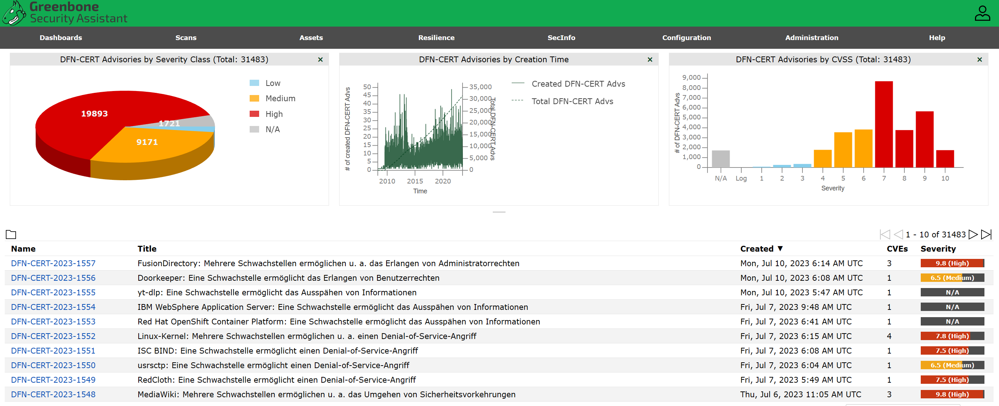
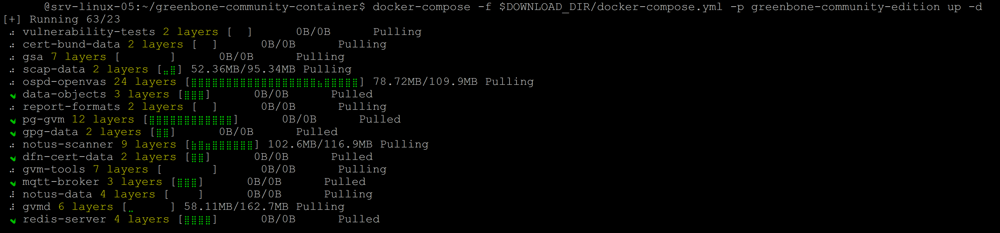

# OnpenVAS

Prérequis :

Vous devez avoir une machine sous Linux (Debian 11 ou 12) avec Docker d’installé et docker-compose.

Vous trouverez ici un tutoriel sur l’installation de Docker, Docker-compose & Portainer.

- Installation manuelle de Docker, [disponible ici](https://github.com/0xCyberLiTech/Docker/blob/main/README.md#installation-manuelle-de-docker)

- Installation manuelle de Docker-compose, [disponible ici](https://github.com/0xCyberLiTech/Docker/blob/main/README.md#installation-manuelle-de-docker-compose)

- Installation manuelle de Portainer, [disponible ici](https://github.com/0xCyberLiTech/Docker/blob/main/README.md#mise-%C3%A0-jour-manuelle-de-portainer)

Stocker vos containers de la manière suivante :
```
~/containers/<stack-name>
```
```
mkdir -p ~/containers/<stack-name>/
mkdir -p ~/containers/openvas/
cd ~/containers/openvas/
```
Déploiement des conteneurs pour OpenVas :

On va commencer pas créer le fichier docker-compose.yml et ensuite l’ouvrir avec nano :
```
touch docker-compose.yml
nano docker-compose.yml
```
Copier le code au complet ci-dessous dans le fichier docker-compose.yml.
```
version: '3.7'

services:
  redis-server:
    image: greenbone/redis-server
    restart: on-failure
    volumes:
      - redis_socket_vol:/run/redis/

  gpg-data:
    image: greenbone/gpg-data
    volumes:
      - gpg_data_vol:/mnt

  pg-gvm:
    image: greenbone/pg-gvm:stable
    restart: on-failure
    volumes:
      - psql_data_vol:/var/lib/postgresql
      - psql_socket_vol:/var/run/postgresql

  gvmd:
    image: greenbone/gvmd:stable
    restart: on-failure
    volumes:
      - gvmd_data_vol:/var/lib/gvm
      - vt_data_vol:/var/lib/openvas
      - psql_data_vol:/var/lib/postgresql
      - gvmd_socket_vol:/run/gvmd
      - ospd_openvas_socket_vol:/run/ospd
      - psql_socket_vol:/var/run/postgresql
    depends_on:
      - pg-gvm

  gsa:
    image: greenbone/gsa:stable
    restart: on-failure
    ports:
      - 9392:80
    volumes:
      - gvmd_socket_vol:/run/gvmd
    depends_on:
      - gvmd

  ospd-openvas:
    image: greenbone/ospd-openvas:stable
    restart: on-failure
    cap_add:
      - NET_ADMIN # for capturing packages in promiscuous mode
      - NET_RAW # for raw sockets e.g. used for the boreas alive detection
    security_opt:
      - seccomp=unconfined
      - apparmor=unconfined
    command: [
      "ospd-openvas",
      "-f",
      "--config", "/etc/gvm/ospd-openvas.conf",
      "--mqtt-broker-address", "mqtt-broker",
      "--notus-feed-dir", "/var/lib/notus/advisories",
      "-m", "666",
    ]
    volumes:
      - gpg_data_vol:/etc/openvas/gnupg
      - vt_data_vol:/var/lib/openvas
      - notus_data_vol:/var/lib/notus
      - ospd_openvas_socket_vol:/run/ospd
      - redis_socket_vol:/run/redis/
    depends_on:
      - redis-server
      - gpg-data

  mqtt-broker:
    restart: on-failure
    image: greenbone/mqtt-broker
    ports:
      - 1883:1883
    networks:
      default:
        aliases:
          - mqtt-broker
          - broker

  notus-scanner:
    restart: on-failure
    image: greenbone/notus-scanner:stable
    volumes:
      - notus_data_vol:/var/lib/notus
      - gpg_data_vol:/etc/openvas/gnupg
    environment:
      NOTUS_SCANNER_MQTT_BROKER_ADDRESS: mqtt-broker
      NOTUS_SCANNER_PRODUCTS_DIRECTORY: /var/lib/notus
    depends_on:
      - mqtt-broker
      - gpg-data

volumes:
  gpg_data_vol:
  gvmd_data_vol:
  psql_data_vol:
  vt_data_vol:
  notus_data_vol:
  psql_socket_vol:
  gvmd_socket_vol:
  ospd_openvas_socket_vol:
  redis_socket_vol:
```
Enregistrer et fermer le fichier docker-compose.yml.

Télécharger les différentes images :
```
docker-compose -p greenbone-community-edition pull
```



Une fois les images téléchargés, démarrer les :
```
docker-compose -p greenbone-community-edition up -d
```


Vous pouvez vérifier que les conteneurs sont bien démarrés avec la commande :
```
docker ps
```

- Synchronisation des tests de vulnérabilités et des données de vulnérabilités. Cette phase va être plus longue, l’injection des données de vulnérabilités et les tests, pour le moment OpenVAS ne contient aucune données.

Pour cette partie, il faut prévoir 1 à 2 heures.

On va commencer par injecter les différents tests de vulnérabilité, pour cela entrer la commande :
```
docker-compose -p greenbone-community-edition exec -u ospd-openvas ospd-openvas greenbone-nvt-sync

         13,036 100%   18.42kB/s    0:00:00 (xfr#757, ir-chk=4737/5526)
gb_dns_os_detection.nasl
         10,170 100%   14.37kB/s    0:00:00 (xfr#758, ir-chk=4736/5526)
gb_dnsmasq_consolidation.nasl
          3,758 100%    5.31kB/s    0:00:00 (xfr#759, ir-chk=4735/5526)
gb_dnsmasq_dns_detect.nasl
          2,341 100%    3.31kB/s    0:00:00 (xfr#760, ir-chk=4734/5526)
gb_dnsmasq_ssh_login_detect.nasl
          3,798 100%    5.37kB/s    0:00:00 (xfr#761, ir-chk=4733/5526)
gb_docker_desktop_ce_detect.nasl
          3,633 100%    5.13kB/s    0:00:00 (xfr#762, ir-chk=4732/5526)
gb_docker_for_windows_detect.nasl
          3,866 100%    5.46kB/s    0:00:00 (xfr#763, ir-chk=4731/5526)
gb_docker_http_rest_api_detect.nasl
          6,051 100%    8.54kB/s    0:00:00 (xfr#764, ir-chk=4730/5526)
gb_docker_ssh_login_detect.nasl
          6,845 100%    9.66kB/s    0:00:00 (xfr#765, ir-chk=4729/5526)
gb_document_manager_detect.nasl
          3,928 100%    5.54kB/s    0:00:00 (xfr#766, ir-chk=4728/5526)
```
Il faut maintenant patienter pour passer à la suite, car celle-ci sont en cours d’injection dans la base de données, le seul moyen que j’ai trouvé pour vérifier l’avancement, c’est de vérifier la charge CPU avec la commande htop.

Quand la charge du serveur est de nouveau faible, on peut considérer que l’injection des données en base est terminée.

- Synchronisation des données SCAP, CERT et GVMD.

Maintenant, on va passer à la synchronisation des données SCAP, CERT et GVMD, la procédure est identique pour la synchronisation des tests, après le téléchargement, patienter pendant l’injection dans la base de données.

- SCAP :
```
docker-compose -p greenbone-community-edition exec -u gvmd gvmd greenbone-feed-sync --type SCAP

     30,569,278 100%  983.72kB/s    0:00:30 (xfr#14, to-chk=29/44)
nvdcve-2.0-2015.xml
     32,900,521 100%  983.90kB/s    0:00:32 (xfr#15, to-chk=28/44)
nvdcve-2.0-2016.xml
     44,989,299 100%  979.46kB/s    0:00:44 (xfr#16, to-chk=27/44)
nvdcve-2.0-2017.xml
     65,483,335 100%  987.73kB/s    0:01:04 (xfr#17, to-chk=26/44)
nvdcve-2.0-2018.xml
     76,891,279 100%  995.23kB/s    0:01:15 (xfr#18, to-chk=25/44)
nvdcve-2.0-2019.xml
     93,951,030 100% 1002.19kB/s    0:01:31 (xfr#19, to-chk=24/44)
nvdcve-2.0-2020.xml
     94,636,614 100%  999.83kB/s    0:01:32 (xfr#20, to-chk=23/44)
nvdcve-2.0-2021.xml
    104,810,861 100%  990.53kB/s    0:01:43 (xfr#21, to-chk=22/44)
nvdcve-2.0-2022.xml
```
- CERT :
```
docker-compose -p greenbone-community-edition exec -u gvmd gvmd greenbone-feed-sync --type CERT

All transactions are logged.

If you have any questions, please use the Greenbone community portal.
See https://community.greenbone.net for details.

By using this service you agree to our terms and conditions.

Only one sync per time, otherwise the source ip will be temporarily blocked.

receiving incremental file list
timestamp
             13 100%   12.70kB/s    0:00:00 (xfr#1, to-chk=0/1)

sent 43 bytes  received 109 bytes  101.33 bytes/sec
total size is 13  speedup is 0.09
Sync in progress, exiting.
```
- GVMD :
```
docker-compose -p greenbone-community-edition exec -u gvmd gvmd greenbone-feed-sync --type GVMD_DATA

All transactions are logged.

If you have any questions, please use the Greenbone community portal.
See https://community.greenbone.net for details.

By using this service you agree to our terms and conditions.

Only one sync per time, otherwise the source ip will be temporarily blocked.

receiving incremental file list
timestamp
             13 100%    2.54kB/s    0:00:00 (xfr#1, to-chk=0/1)

sent 43 bytes  received 109 bytes  60.80 bytes/sec
total size is 13  speedup is 0.09
Sync in progress, exiting.
```
Le scanner de vulnérabilité est à présent opérationnel.

Depuis un navigateur, entrer l’ip ou l’url du serveur sur le port (9392) :
```
http://mon-ip-srv-openvas:9392
```
Les identifiants par défaut sont admin / admin.


- Note pour stopper la stack ~/containers/openvas/
```
docker-compose -p greenbone-community-edition stop
```


