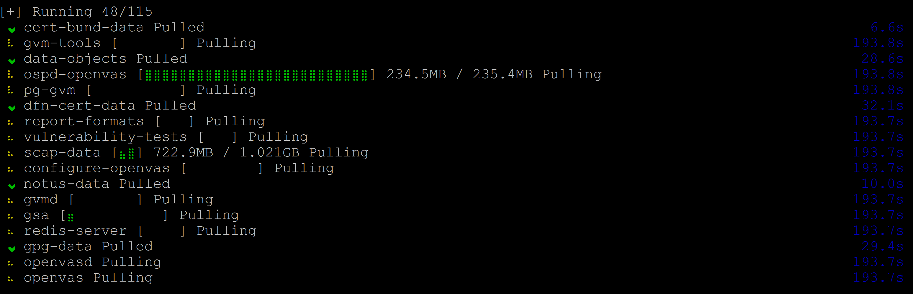
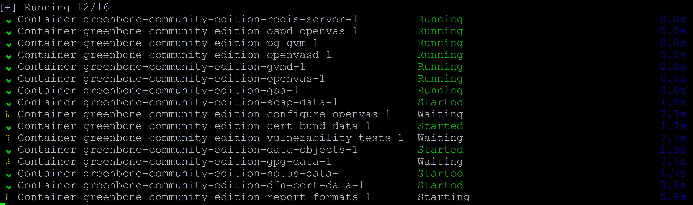
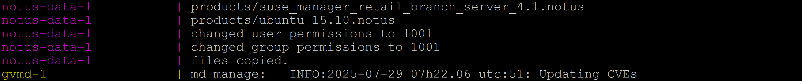

<p align="center">
  <a href="https://github.com/0xCyberLiTech" target="_blank" rel="noopener">
    
  </a>
</p>

<div align="center">

  <a href="https://github.com/0xCyberLiTech">
    
  </a>
  
  <p align="center">
    <em>Tuto - Déploiement de Greenbone Community Edition (OpenVAS) via Docker sur Debian 12..</em><br>
    <b>📊 Monitoring – 📈 Performance – ⚙️ Fiabilité</b>
  </p>
  
  [](https://github.com/0xCyberLiTech)
  [](https://github.com/0xCyberLiTech/OpenVAS/releases/latest)
  [](https://github.com/0xCyberLiTech/OpenVAS/blob/main/CHANGELOG.md)
  [](https://github.com/0xCyberLiTech?tab=repositories)
  [](https://github.com/0xCyberLiTech/OpenVAS/graphs/contributors)

</div>

---

### 👨‍💻 **À propos de moi.**

> Bienvenue dans mon **laboratoire numérique personnel** dédié à l’apprentissage et à la vulgarisation de la cybersécurité.  
> Passionné par **Linux**, la **cryptographie** et les **systèmes sécurisés**, je partage ici mes notes, expérimentations et fiches pratiques.  
>  
> Pproposer un contenu clair, structuré et accessible pour étudiants, curieux et professionnels de l’IT.  
> 🔗 [Mon GitHub principal](https://github.com/0xCyberLiTech)

<p align="center">
  <a href="https://github.com/0xCyberLiTech" target="_blank" rel="noopener">
    
  </a>
</p>

---

### 🎯 **Objectif de ce dépôt.**

> Ce dépôt a pour vocation de centraliser un ensemble de notions clés autour d'OpenVAS (Open Vulnerability Assessment System). Il s’adresse aux passionnés, étudiants et professionnels souhaitant mieux comprendre
> les principes de l'analyse de vulnérabilités, apprendre à installer, configurer et utiliser OpenVAS pour identifier les faiblesses de leurs systèmes, et se familiariser avec les concepts et outils essentiels
> pour renforcer la sécurité de leurs infrastructures informatiques.

---


## 🛡️ Déploiement de Greenbone Community Edition (OpenVAS) via Docker.

## 🧰 Prérequis

- Tuto validé sur **Debian 12**.
- **Docker** + **Docker Compose** doivent être installés au paravent :

<div align="center">

  | Catégorie | Sujet | Accès Rapide |
  |:---:|:---|:---:|
  | **Tutos & Outils** | Installation manuelle de Docker & Docker Compose | [](https://github.com/0xCyberLiTech/Docker/blob/main/DOCKER-et-DOCKER-COMPOSE-Installation-manuelle.md) |
  | **Tutos & Outils** | Installation manuelle de Portainer | [](https://github.com/0xCyberLiTech/Docker/blob/main/PORTAINER-Installation-manuelle.md) |

</div>

- Exécuter la procédure sous **`su`** pour éviter les problèmes de permission.
- Ajouter l’utilisateur courant au groupe `docker` :

```bash
sudo usermod -aG docker $USER && su $USER
```

- Installez les dépendances si cela n’a pas déjà été fait.

```bash
sudo apt install apt-transport-https ca-certificates curl gnupg
```

---

## 🐳 Déploiement de Greenbone avec Docker

### 📁 Créer le répertoire de travail

```bash
export DOWNLOAD_DIR=$HOME/greenbone-community-container
```

```bash
mkdir -p $DOWNLOAD_DIR
```

```bash
cd $DOWNLOAD_DIR
```

<div align="center">
  ⚠️ - Veillez à toujours utiliser la **dernière version** du fichier `docker-compose.yml`. - ⚠️
</div>

---

## 📦 Obtenir le fichier `docker-compose.yml`

### 1️⃣ Méthode manuelle

Créer le fichier :

```bash
nano docker-compose.yml
```

Coller le contenu du fichier officiel :
👉 Voir ici : [docker-compose.yml](https://greenbone.github.io/docs/latest/_static/docker-compose.yml)

---

### 2️⃣ Téléchargement du fichier **docker-compose.yml**.

```bash
curl -f -O -L https://greenbone.github.io/docs/latest/_static/docker-compose.yml --output-dir "$DOWNLOAD_DIR"
```
Note : Accès à distance à l’interface Web.

Lors de l’utilisation du fichier docker compose, le serveur web est configuré pour écouter uniquement sur l’adresse locale de l’hôte (127.0.0.1). Pour autoriser l’accès à distance sur tous les interfaces de l’hôte, le fichier de composition doit être modifié pour configurer le Serveur GSAD pour écouter sur toutes les interfaces réseau.

La modification suivante du fichier docker compose doit être appliquée :

```bash
cd $DOWNLOAD_DIR
```

```bash
nano docker-compose.yml
```

Autorisation d’accès sur toutes les interfaces hôtes.
Localiser la section **  gsa: ** et apporter les modifications nécessaires :

**Avant modification :**

```bash
  gsa:
    image: registry.community.greenbone.net/community/gsa:stable
    restart: on-failure
    ports:
      - 127.0.0.1:9392:80
```

**Après modification :**

```bash
  gsa:
    image: registry.community.greenbone.net/community/gsa:stable
    restart: on-failure
    ports:
      - 127.0.0.1:9392:80
      - 9392:80
```

---

## 🔧 Lancement des conteneurs communautaires Greenbone :

À l’aide du fichier docker compose, les images du conteneur peuvent être téléchargées (extraites).

### ➤ Téléchargement des conteneurs communautaires Greenbone :

```bash
docker compose -f $DOWNLOAD_DIR/docker-compose.yml pull
```

<div align="center">

  

</div>

### ➤ Lancement des conteneurs communautaires Greenbone :

```bash
docker compose -f $DOWNLOAD_DIR/docker-compose.yml up -d
```

<div align="center">

  

</div>

---

## 📋 Logs et supervision

Pour obtenir un flux continu de la sortie du journal de tous les services, exécutez ce qui suit commander :

### ➤ Afficher les messages de journal de tous les services des conteneurs en cours d’exécution

```bash
     docker compose -f $DOWNLOAD_DIR/docker-compose.yml logs -f
```

<div align="center">

  

</div>

### ➤ Le flux de journaux peut être arrêté en appuyant sur (Ctrl-C)

---

## 🔐 Configuration d’un utilisateur administrateur (admin).

⚠️ Avertissement :

Par défaut, un utilisateur `admin` avec le mot de passe `admin` est créé.

> 🔐 **Il est fortement recommandé de le changer immédiatement.**

Mise à jour du mot de passe de l’utilisateur administrateur.

```bash
docker compose -f $DOWNLOAD_DIR/docker-compose.yml \
    exec -u gvmd gvmd gvmd --user=admin --new-password='<password>'
```

Note :

⚠️ Veuillez faire attention si votre mot de passe comprend des caractères spéciaux.

---

## 🌍 Accès à l’interface Web :

Démarrage de la gestion des vulnérabilités.

Une fois que les services ont démarré et que toutes les données du flux ont été chargées, l’interface Web de Greenbone Security Assistant – GSA – peut être ouverte dans le navigateur.

```bash
xdg-open "http://127.0.0.1:9392" 2>/dev/null >/dev/null &
```

Le navigateur affichera la page de connexion de GSA et après avoir utilisé les informations d’identification Créé auparavant, il est possible de commencer par l’analyse des vulnérabilités.


Partir de zéro :

Pour repartir de zéro, les conteneurs doivent être arrêtés. Par la suite, le Les conteneurs et les volumes doivent être supprimés pour supprimer toutes les données. Tout cela peut être fait avec la commande suivante :

```bash
docker compose -f $DOWNLOAD_DIR/docker-compose.yml down -v
```

## 📋 Script d’installation et de démarrage :

Note :

N’oubliez pas de suivre d’abord les instructions décrites dans les conditions préalables.

Comme solution rapide, nous fournissons toutes les commandes ci-dessus dans un seul script. 

Ceci Le script peut être téléchargé directement avec la commande suivante :

### ➤ Téléchargement du script d’installation et de démarrage sur le répertoire de travail actuel.

```bash
curl -f -O https://greenbone.github.io/docs/latest/_static/setup-and-start-greenbone-community-edition.sh && chmod u+x setup-and-start-greenbone-community-edition.sh
```

### ➤ Pour exécuter le script, la commande suivante doit être exécutée.

Exécuter le programme d’installation et démarrer le script.

```bash
chmod +x setup-and-start-greenbone-community-edition.sh
```

```bash
./setup-and-start-greenbone-community-edition.sh
```

## 📋 Repartir de zéro :

Pour repartir de zéro, les conteneurs doivent être arrêtés. Par la suite, le Les conteneurs et les volumes doivent être supprimés pour supprimer toutes les données. Tout cela peut être fait En courant :

Supprimer les conteneurs et les volumes (toutes les données).

```bash
docker compose -f $DOWNLOAD_DIR/docker-compose.yml down -v
```

---

## 📚 Références

- 📘 [Documentation officielle Greenbone](https://greenbone.github.io/docs/latest/container/container.html)
- 🐙 [Dépôt GitHub du projet](https://github.com/greenbone/greenbone-community-container)

---

<p align="center">
  <b>🔒 Un guide proposé par <a href="https://github.com/0xCyberLiTech">0xCyberLiTech</a> • Pour des tutoriels accessibles à tous. 🔒</b>
</p>
