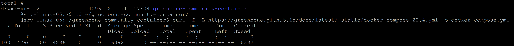
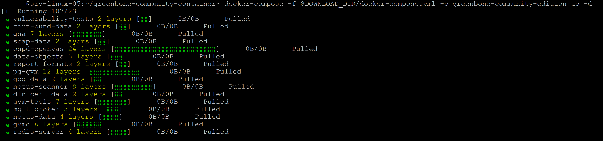
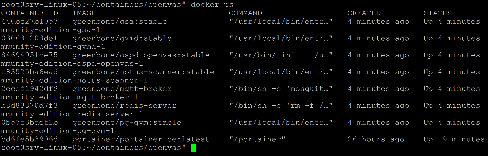
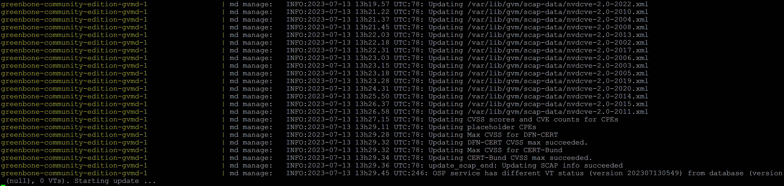
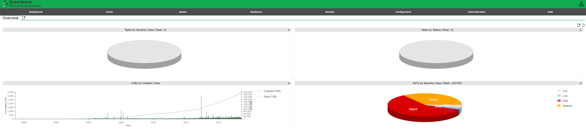

# OPENVAS

Prérequis :

Cette procédure à été testée depuis une machine sous (Debian 12) avec Docker, Docker compose v2 et Portainer.

Vous trouverez ici un tutoriel sur l’installation de Docker, Docker compose v2 & Portainer.

- Installation manuelle de Docker Engine & Docker-compose-plugin v2, [disponible ici](https://github.com/0xCyberLiTech/Docker/blob/main/DOCKER-et-DOCKER-COMPOSE-Installation-manuelle.md)

- Installation manuelle de Portainer, [disponible ici](https://github.com/0xCyberLiTech/Docker/blob/main/PORTAINER-Installation-manuelle.md)

Conditions préalables :

- Rappel .

Si vous avez installer une DEBIAN 12 de base, (sudo) n'est pas installé.

Procéder à l'installation de celui-ci.

```
su - root
apt install sudo
usermod -aG sudo cyberlitech
init 6
```
Se connecter au terminal, avec le user (ex, cyberlitech).

Veuillez suivre le guide étape par étape.

Les étapes ultérieures peuvent nécessiter des paramètres ou sortie d’une commande précédente.

La commande sudo est utilisée pour exécuter des commandes qui nécessitent un privilège accès sur le système.

Pour permettre à l’utilisateur actuel d’exécuter docker et donc de démarrer le conteneurs, ils doivent être ajoutés au groupe d’utilisateurs Docker. Pour modifier le groupe Effectivement, déconnectez-vous et reconnectez-vous ou utilisez SU.

Ci celà n'est pas dèja fait :

```
sudo usermod -aG docker $USER && su $USER
```
- Installer le paquet curl :

Curl est requis pour télécharger des fichiers à partir de ce guide.
```
sudo apt install curl
```
Pour télécharger le fichier docker-compose.yml de (Greenbone Community Edition).

Le répertoire de destination doit être créé.

Créer un répertoire de téléchargement.
```
export DOWNLOAD_DIR=$HOME/greenbone-community-container && mkdir -p $DOWNLOAD_DIR
```
Fichier docker-compose.yml.

Pour exécuter Greenbone Community Edition avec des conteneurs, les éléments suivants sont composés doit être utilisé:

Fichier de composition Docker.
```
services:
  vulnerability-tests:
    image: greenbone/vulnerability-tests
    environment:
      STORAGE_PATH: /var/lib/openvas/22.04/vt-data/nasl
    volumes:
      - vt_data_vol:/mnt

  notus-data:
    image: greenbone/notus-data
    volumes:
      - notus_data_vol:/mnt

  scap-data:
    image: greenbone/scap-data
    volumes:
      - scap_data_vol:/mnt

  cert-bund-data:
    image: greenbone/cert-bund-data
    volumes:
      - cert_data_vol:/mnt

  dfn-cert-data:
    image: greenbone/dfn-cert-data
    volumes:
      - cert_data_vol:/mnt
    depends_on:
      - cert-bund-data

  data-objects:
    image: greenbone/data-objects
    volumes:
      - data_objects_vol:/mnt

  report-formats:
    image: greenbone/report-formats
    volumes:
      - data_objects_vol:/mnt
    depends_on:
      - data-objects

  gpg-data:
    image: greenbone/gpg-data
    volumes:
      - gpg_data_vol:/mnt

  redis-server:
    image: greenbone/redis-server
    restart: on-failure
    volumes:
      - redis_socket_vol:/run/redis/

  pg-gvm:
    image: greenbone/pg-gvm:stable
    restart: on-failure
    volumes:
      - psql_data_vol:/var/lib/postgresql
      - psql_socket_vol:/var/run/postgresql

  gvmd:
    image: greenbone/gvmd:stable
    restart: on-failure
    volumes:
      - gvmd_data_vol:/var/lib/gvm
      - scap_data_vol:/var/lib/gvm/scap-data/
      - cert_data_vol:/var/lib/gvm/cert-data
      - data_objects_vol:/var/lib/gvm/data-objects/gvmd
      - vt_data_vol:/var/lib/openvas/plugins
      - psql_data_vol:/var/lib/postgresql
      - gvmd_socket_vol:/run/gvmd
      - ospd_openvas_socket_vol:/run/ospd
      - psql_socket_vol:/var/run/postgresql
    depends_on:
      pg-gvm:
        condition: service_started
      scap-data:
        condition: service_completed_successfully
      cert-bund-data:
        condition: service_completed_successfully
      dfn-cert-data:
        condition: service_completed_successfully
      data-objects:
        condition: service_completed_successfully
      report-formats:
        condition: service_completed_successfully

  gsa:
    image: greenbone/gsa:stable
    restart: on-failure
    ports:
      - 9392:80
    volumes:
      - gvmd_socket_vol:/run/gvmd
    depends_on:
      - gvmd

  ospd-openvas:
    image: greenbone/ospd-openvas:stable
    restart: on-failure
    init: true
    hostname: ospd-openvas.local
    cap_add:
      - NET_ADMIN # for capturing packages in promiscuous mode
      - NET_RAW # for raw sockets e.g. used for the boreas alive detection
    security_opt:
      - seccomp=unconfined
      - apparmor=unconfined
    command:
      [
        "ospd-openvas",
        "-f",
        "--config",
        "/etc/gvm/ospd-openvas.conf",
        "--mqtt-broker-address",
        "mqtt-broker",
        "--notus-feed-dir",
        "/var/lib/notus/advisories",
        "-m",
        "666"
      ]
    volumes:
      - gpg_data_vol:/etc/openvas/gnupg
      - vt_data_vol:/var/lib/openvas/plugins
      - notus_data_vol:/var/lib/notus
      - ospd_openvas_socket_vol:/run/ospd
      - redis_socket_vol:/run/redis/
    depends_on:
      redis-server:
        condition: service_started
      gpg-data:
        condition: service_completed_successfully
      vulnerability-tests:
        condition: service_completed_successfully

  mqtt-broker:
    restart: on-failure
    image: greenbone/mqtt-broker
    ports:
      - 1883:1883
    networks:
      default:
        aliases:
          - mqtt-broker
          - broker

  notus-scanner:
    restart: on-failure
    image: greenbone/notus-scanner:stable
    volumes:
      - notus_data_vol:/var/lib/notus
      - gpg_data_vol:/etc/openvas/gnupg
    environment:
      NOTUS_SCANNER_MQTT_BROKER_ADDRESS: mqtt-broker
      NOTUS_SCANNER_PRODUCTS_DIRECTORY: /var/lib/notus/products
    depends_on:
      - mqtt-broker
      - gpg-data
      - vulnerability-tests

  gvm-tools:
    image: greenbone/gvm-tools
    volumes:
      - gvmd_socket_vol:/run/gvmd
      - ospd_openvas_socket_vol:/run/ospd
    depends_on:
      - gvmd
      - ospd-openvas

volumes:
  gpg_data_vol:
  scap_data_vol:
  cert_data_vol:
  data_objects_vol:
  gvmd_data_vol:
  psql_data_vol:
  vt_data_vol:
  notus_data_vol:
  psql_socket_vol:
  gvmd_socket_vol:
  ospd_openvas_socket_vol:
  redis_socket_vol:
```
Description.

Le tableau suivant décrit les conteneurs fournis du fichier de composition docker et leurs services en détail.

| Conteneur |  Service |  Description    |
|-----------|----------|-----------------|
| redis-serveur | Serveur Redis | Un serveur redis avec une configuration ajustée. Utilisé pour stocker les données VT et numériser les résultats par le scanner. |
| pg-gvm | PostgreSQL | Une configuration de cluster de base de données PostgreSQL à utiliser avec gvmd. Les données réelles sont stockées dans le volume.psql_data_vol |
| gvmd | gvmd | Conteneur pour gvmd qui utilise des sockets unix dans les volumes pour communiquer avec la base de données PostgreSQL et l’analyseur ospd-openvas. Les données de flux téléchargées sont stockées dans le volume. Pour vérifier les données d’alimentation, le trousseau de clés GPG du est utilisé.gvmd_data_volgpg_data_vol |
| gsa | gsad | Conteneur exécutant le serveur Web gsad pour fournir l’application Web GSA. L’interface Web est disponible sur localhost sur le port 9392. Pour la communication avec gvmd, un socket unix dans un volume est utilisé. |
| ospd-openvas | ospd-openvas | Un conteneur fournissant le scanner de vulnérabilité. Les données VT du flux sont stockées dans le volume. Pour vérifier les données d’alimentation, le trousseau de clés GPG du est utilisé. La connexion au serveur redis est établie via un socket unix dans un volume.vt_data_volgpg_data_vol |
| mqtt-broker | Mosquitto MQTT Broker | Un MQTT Broker utilisé pour la communication entre notus-scanner, openvas-scanner et ospd-openvas. |
| notus-scanner | notus-scanner | Conteneur exécutant le scanner notus utilisé pour les contrôles de sécurité locaux. Pour vérifier les données d’alimentation, le trousseau de clés GPG du est utilisé. Les données d’alimentation pour notus-scanner lui-même sont stockées dans le fichier .gpg_data_volnotus_data_vol |
| gvm-tools |  | Un conteneur fournissant l’interface de ligne de commande gvm-tools pour interroger et contrôler gvmd et ospd-openvas. |
| gpg-data  |  | Conteneur qui copie un trousseau de clés GPG avec les clés de signature publiques de Greenbone dans le volume au démarrage. Il sort après.gpg_data_vol |
| vulnerability-tests |  | Conteneur qui copie les tests de vulnérabilité (VT) dans le volume au démarrage. Affiche la licence et se ferme par la suite.vt_data_vol |
| notus-data |  | Conteneur qui copie les informations de vulnérabilité de notus-scanner dans le volume au démarrage. Affiche la licence et se ferme par la suite.notus_data_vol |
| scap-data  |  | Conteneur qui copie les données CVE et CPE dans le volume au démarrage. Affiche la licence et se ferme par la suite.scap_data_vol |
| cert-bund-data |  | Conteneur qui copie les données CERT-Bund dans le volume au démarrage. Affiche la licence et se ferme par la suite.cert_data_vol |
| dfn-cert-data |  | Conteneur qui copie les données DFN-CERT dans le volume au démarrage. Affiche la licence et se ferme par la suite.cert_data_vol |
| data-objects |  | Conteneur qui copie les configurations d’analyse, les stratégies de conformité et les listes de ports dans le volume au démarrage. Affiche la licence et se ferme par la suite.data_objects_vol |
| report-formats |  | Conteneur qui copie les formats de rapport dans le volume au démarrage. Affiche la licence et se ferme par la suite.data_objects_vol |

Lancement des conteneurs communautaires Greenbone.

À l’aide du fichier docker compose, les images du conteneur peuvent être téléchargées (extraites) et les conteneurs peuvent être démarrés en arrière-plan.

Télécharger :

Il est possible de simplement copier et coller le fichier de composition docker.

Alternativement Il peut être téléchargé directement avec la commande suivante :

Téléchargement du fichier docker-compose.yml
```
cd $DOWNLOAD_DIR && curl -f -L https://greenbone.github.io/docs/latest/_static/docker-compose-22.4.yml -o docker-compose.yml
```


Lancement des conteneurs communautaires Greenbone.

À l’aide du fichier docker-compose.yml, les images du conteneur peuvent être téléchargées (extraites) et les conteneurs peuvent être démarrés en arrière-plan.

Téléchargement des conteneurs communautaires Greenbone
```
docker-compose -f $DOWNLOAD_DIR/docker-compose.yml -p greenbone-community-edition pull
```




Lancement des conteneurs communautaires Greenbone
```
docker-compose -f $DOWNLOAD_DIR/docker-compose.yml -p greenbone-community-edition up -d
```


Ou pour obtenir un flux continu de la sortie du journal de tous les services, exécutez la commande suivante commander :

Afficher les messages de journal de tous les services à partir des conteneurs en cours d’exécution.
```
sudo docker compose -f docker-compose.yml -p greenbone-community-edition logs -f
```


Le flux du journal de logs peut être arrêté en appuyant sur . Ctrl + c

Configuration d’un utilisateur administrateur.

Avertissement :

Par défaut, un administrateur utilisateur avec le mot de passe admin est créé. 

Ce n’est pas sûr. Et il est fortement recommandé de définir un nouveau mot de passe.

Pour mettre à jour l’utilisateur administrateur avec un mot de passe de votre choix au lieu du mot de passe généré, la commande suivante peut être utilisée :

Mise à jour du mot de passe de l’utilisateur administrateur.
```
sudo docker compose -f docker-compose.yml -p greenbone-community-edition \
    exec -u gvmd gvmd gvmd --user=admin --new-password=admin
```
Démarrage de la gestion des vulnérabilités.

Une fois que les services ont démarré et que toutes les données de flux ont été chargées, l’interface Web de Greenbone Security Assistant – GSA – peut être ouverte dans le navigateur.

Ouverture de Greenbone Security Assistant dans le navigateur.
```
xdg-open "http://127.0.0.1:9392" 2>/dev/null >/dev/null &
```
Le navigateur affichera la page de connexion de GSA et après avoir utilisé les informations d’identification Créé auparavant, il est possible de commencer par l’analyse des vulnérabilités.



# Dépannage :

Avertissement.

Les commandes des instructions de dépannage suivantes ne sont valides que si vous a suivi la documentation de génération source.

Si vous avez installé le Greenbone Community Edition via une distribution Linux (par exemple Kali Linux), le Les commandes peuvent être légèrement différentes et doivent être ajustées.

Faire face à un problème avec l’édition Greenbone Community.

Si vous avez un problème avec Greenbone Community Edition parce que quelque chose ne fonctionne pas comme prévu et/ou vous obtenez une erreur dans l’interface utilisateur Web Il est nécessaire de vérifier les fichiers journaux pour obtenir des conseils techniques sur le problème.

Si quelque chose ne fonctionne pas pendant l’analyse, les fichiers et doivent être vérifiés pour les erreurs.
```
/var/log/gvm/ospdopenvas.log/var/log/gvm/openvas.log
```
Sinon, le fichier doit être inspecté.
```
/var/log/gvm/gvmd.log
```
Ensuite, l’utilisation des messages d’erreur collectés dans la recherche de notre forum communautaire peut faire apparaître des résultats possibles pour résoudre le problème déjà.

Si aucun résultat approprié ne peut être trouvé, n’hésitez pas à créer un nouveau sujet sur notre forum communautaire.

Un message dans le forum devrait contiennent toujours la méthode d’installation et la version du Greenbone Community Edition (construit à partir de la source via ce guide, communauté officielle conteneurs, colis Kali, ...) et le message d’erreur trouvé.

Impossible de trouver port_list '33d0cd82-57c6-11e1-8ed1-406186ea4fc5'

Cette erreur peut se produire lors de la liaison à l’aide de l’Assistant Tâche pour créer une analyse rapide après la configuration initiale.

Cela est dû au fait que gvmd ne peut pas charger Le port répertorie les listes du flux dans sa base de données. Pour résoudre ce problème, vous besoin de vérifier si contient le code XML de la liste des ports lime:/var/lib/gvm/data-objects/

Vérifier si la liste des ports est déjà synchronisée.
```
find /var/lib/gvm/data-objects/ -name "*33d0cd82-57c6-11e1-8ed1-406186ea4fc5*.xml"
```
Si la commande find ne renvoie pas de fichier XML pour votre version, le Les objets de données n’ont pas (encore) été synchronisés à partir du flux.

Synchronisation des objets de données traités par gvmd.
```
sudo -u gvm greenbone-feed-sync --type GVMD_DATA
```
Deuxièmement, gvmd devrait être forcé de (re)charger les objets de données, y compris Le port répertorie à partir du disque.

Synchronisation des objets de données traités par gvmd.
```
sudo -u gvm gvmd --rebuild-gvmd-data=all
```
Impossible de trouver la configuration.

Ce problème est similaire à Impossible de trouver port_list.

Il sera déclenché si gvmd n’est pas en mesure de charger les configurations d’analyse à partir de le système de fichiers dans sa base de données.

Tout d’abord, vous devez vérifier si l’analyse Les configurations ont été téléchargées à partir du flux.

Vérifier si les configurations d’analyse sont déjà synchronisées.
```
find /var/lib/gvm/data-objects/ -name "*daba56c8-73ec-11df-a475-002264764cea*.xml"
```
Si la commande find ne renvoie pas au moins un fichier XML pour votre , les objets de données n’ont pas (encore) été synchronisés à partir du flux.

Synchronisation des objets de données traités par gvmd.
```
sudo -u gvm greenbone-feed-sync --type GVMD_DATA
```
Parce que les configurations d’analyse font référence aux VT chargeant également les configurations d’analyse nécessite des VT synchronisés à partir du flux.

Vous pouvez vérifier si les VT sont déjà chargé en consultant la page de l’interface utilisateur Web Secinfo ‣ NVTs.

S’il n’y a pas de VT visibles dans l’interface utilisateur Web, ils doivent être téléchargés à partir du nourrir.

Synchronisation des VT traités par le scanner openvas.
```
sudo -u gvm greenbone-nvt-sync
```
Le chargement des VT à partir du système de fichiers peut prendre un certain temps.

À partir de plusieurs minutes en heures en fonction des performances de votre système et du nombre de VT. Vous peut suivre le processus de chargement des VT en consultant les fichiers :
```
et./var/log/gvm/ospd-openvas.log/var/log/gvm/gvmd.log
```
S’il n’y a toujours pas de configurations d’analyse dans Configuration ‣ Scan Configs dans l’interface utilisateur Web après quelques heures et que les journaux de gvmd et ospd-openvas ne s’affichent pas erreurs, le peut ne pas avoir été défini.Feed Import Owner

Définition de l' Feed Import Owner.
```
gvmd --modify-setting 78eceaec-3385-11ea-b237-28d24461215b --value `gvmd --get-users --verbose | grep admin | awk '{print $2}'`
```
Si toutes ces étapes ne résolvent pas le problème, il s’agit très probablement d’un problème plus important. par exemple avec la base de données PostgreSQL.

Par conséquent, les fichiers et doivent être inspectés pour détecter d’éventuels messages d’erreur et d’avertissement./var/log/gvm/ospd-openvas.log/var/log/gvm/gvmd.log

Les vulnérabilités sont introuvables.

Un rapport d’analyse ne contient aucun résultat ou certaines vulnérabilités connues n’en contiennent pas. apparaissent dans le rapport.

Cela peut avoir plusieurs raisons. Très probablement, la synchronisation du flux n’est pas C’est encore terminé.

Les données de flux ont été téléchargées dans le système de fichiers du local machine put gvmd et ospd-openvas n’avaient pas assez de ressources pour les charger dans leurs bases de données et leur mémoire.

Cela peut être vérifié en regardant sur la page SecInfo ‣ NVT si les VT sont répertoriés ici et sur la page Administration ‣ État du flux pour un processus de synchronisation dans l’interface utilisateur Web.

Rappel :

- (Télécharger les conteneurs communautaires Greenbone)

```
mkdir ~/greenbone-community-container/
```
```
cyberlitech@0xCLT:~$
docker compose -f greenbone-community-container/docker-compose.yml -p greenbone-community-edition pull
```
- (Démarrer les conteneurs communautaires Greenbone)
```
cyberlitech@0xCLT:~$
docker compose -f greenbone-community-container/docker-compose.yml -p greenbone-community-edition up -d
```
- (Stopper les conteneurs communautaires Greenbone)
```
cyberlitech@0xCLT:~$
docker compose -f greenbone-community-container/docker-compose.yml -p greenbone-community-edition stop
```
- (Supprimer les conteneurs communautaires Greenbone)
```
cyberlitech@0xCLT:~$
docker compose -f greenbone-community-container/docker-compose.yml -p greenbone-community-edition down
```
Source : https://greenbone.github.io/docs/latest/22.4/container/index.html

## Actualité sur les vulnérabilités à ce jour :

## AMD :

AMD contraint de réduire les performances de ses processeurs à cause d’une faille de sécurité.

Mauvaise nouvelle pour les propriétaires de processeurs AMD. Une faille de sécurité a été découverte sur les puces, et en la corrigeant, AMD a dû réduire les performances de tous ses processeurs Zen.

AMD a récemment dévoilé une vulnérabilité nommée “Inception”, qui manipule un processeur en créant une instruction qui l’incite à répéter une fonction. Cette faille peut potentiellement conduire à des fuites de données, ce qui représente une menace sérieuse pour les organisations qui traitent des informations confidentielles. Cette vulnérabilité touche tous les processeurs Zen, c'est-à-dire une grande partie des utilisateurs de puces AMD.

L’entreprise a rapidement pris des mesures pour remédier à la vulnérabilité, mais les correctifs ont été accompagnés d’une conséquence inattendue : une baisse significative des performances du processeur, en particulier pour certaines applications.

Lire également – AMD Ryzen : cette faille permet de voler vos mots de passe et ne sera pas corrigée avant la fin d’année

AMD DIMINUE LES PERFORMANCES DE SES PROCESSEURS POUR AMÉLIORER LEUR SÉCURITÉ
Phoronix, une source bien connue de tests de Linux et de matériel, s'est penché sur l'impact des nouvelles mesures d'atténuation du microcode sur les performances. Les résultats, en particulier pour le processeur EPYC 7763 d'AMD, dressent un tableau plutôt inquiétant pour de nombreux utilisateurs.

En effet, les benchmarks réalisés par Phoronix révèlent que le correctif de la faille « Inception » peut entraîner une baisse des performances pouvant aller jusqu'à 54 %. Cette réduction substantielle de la puissance peut avoir un impact significatif sur les applications qui reposent sur le traitement des données, et donc de nombreuses industries.

Évidemment, l'ampleur de la dégradation des performances varie en fonction de l'application utilisée. Les applications courantes telles que Blender et Mozilla Firefox ne sont que peut impactées, et certaines ne présentent même aucun changement perceptible. Cependant, les tâches plus gourmandes en ressources, telles que celles qui impliquent des processus lourds en données comme MariaDB, ont connu une baisse significative des performances, dépassant la barre des 50 %.

AMD n’est d’ailleurs pas le seul à faire face à de tels problèmes, puisqu’Intel avait lui aussi dû récemment sacrifier plus de 50% des performances de certaines puces pour combler la faille « Downfall ».

Heureusement, il y a une bonne nouvelle pour les joueurs. Phoronix a réalisé le test 3DMark Wildlife Extreme qui a révélé une baisse insignifiante des performances, ce qui est de bon augure pour les jeux vidéo. Les gamers ne devraient donc pas être impactés par cette réduction de la puissance des processeurs sur les applications gourmandes.

Autre info concernant AMD :

La faille Zenbleed rend indiscrètes les puces Ryzen et Epyc d'AMD.

Alaina Yee, IDG NS (adapté par Jean Elyan) , publié le 25 Juillet 2023

Un chercheur a découvert une faille dans l'architecture Zen 2 des puces Ryzen et Epyc d'AMD. Exploitable à distance, elle peut aboutir à des vols de données sensibles. Le fournisseur prévoit une mise à jour du firmware, mais pas avant l'automne pour les puces grand public.

Spectre, Meltdown, ces noms de vulnérabilités touchant les puces Intel et AMD résonnent encore dans la tête des spécialistes de la cybersécurité. Il faudra peut-être compter sur une autre faille répondant au nom de « Zenbleed ». Découverte par Tavis Ormandy, chercheur chez Google, elle touche les puces sous architecture Zen 2 d’AMD et permet de voler des mots de passe et des clés de chiffrement.

Plus précisément, Zenbleed concerne les séries AMD Ryzen 3000, 4000, 5000 et 7020, plus les séries Ryzen Pro 3000 et 4000. La gamme de processeurs EPYC Rome, utilisée dans les datacenters, est également atteinte. En exploitant la vulnérabilité, un hacker peut récupérer des données présentes sur la machine à la vitesse de 30 kb par seconde et par cœur du processeur. Assez rapide pour voler des mots de passe ou des clés de chiffrement qui transitent par le composant

La brèche affecte les puces grand public sous l’appellation Ryzen et celles dédiées aux serveurs sous la marque Epyc. Dans le détail, la famille Ryzen touchée comprend la série 3000 (classique, pro et threadripper), la série 4000 (Pro, avec Radeon Graphics), la série 5000 avec Radeon Graphics, la série 7020 avec Radeao Graphics. Pour la gamme Epyc, seule la série Rome semble concernée.

Une extraction de données sensibles à distance.

Tavis Ormandy souligne dans un message avoir informé AMD du l’existence de la faille Zenbleed à la mi-mai. Ce qui la distingue des autres failles connues, c’est qu’il n’est pas nécessaire d’avoir un accès physique au PC. Elle peut-être activée via un Javascript sur une page Web. Une fois exécutée, un attaquant est capable de voir n’importe quelle opération du processeur, y compris celles qui se déroulent dans des sandbox ou des machines virtuelles.

La faille est identifiée comme CVE-2023-20593 et elle est causée par la mauvaise gestion d'une instruction appelée « vzeroupper » lors de l'exécution spéculative, une technique d'amélioration des performances courante utilisée dans tous les processeurs récents. Le chercheur a mis au point un exploit capable « d’extraire des datas à 30 Ko par cœur, par seconde ». Et d’ajouter « c'est assez rapide pour surveiller les clés de chiffrement et les mots de passe lorsque les utilisateurs se connectent ! »

Des mises à jour du firmware d’ici la fin de l’année

Aujourd’hui, AMD n’a publié qu’une mise à jour du firmaware pour les puces serveurs Epyc de seconde génération, ainsi qu’un bulletin de sécurité et un calendrier de publication des mesures d’atténuation. Par contre pour les puces à destination du grand public, un patch sera livré d’ici la fin de l’année par l’intermédiaire des constructeurs de PC (comme Dell ou HP) et les fabricants de carte-mère. Les puces Threadripper 3000 seront les premières à recevoir la mise à jour du firmware en octobre, puis les puces mobiles Ryzen 4000 en novembre. Pour les autres, il faudra attendre décembre 2023.

Pour ceux qui ne souhaitent pas attendre, Tavis Ormandy donne une solution de contournement en modifiant certains paramètres logiciels. Cependant, il prévient que l’impact sur les performances des CPU n’est pas connu. Il recommande aussi aux utilisateurs de vérifier régulièrement les mises à jour proposées par AMD.

## Intel :

Le Monde - Publié le 09 août 2023 à 11h13

https://www.lemonde.fr/pixels/article/2023/08/09/une-faille-de-securite-importante-decouverte-sur-des-processeurs-intel_6184900_4408996.html

Une faille de sécurité importante découverte sur des processeurs Intel.

Baptisée Downfall, la vulnérabilité permet de contourner les barrières protégeant des informations confidentielles, comme les mots de passe, dans la mémoire des processeurs.

Vous pouvez partager un article en cliquant sur les icônes de partage en haut à droite de celui-ci. 
La reproduction totale ou partielle d’un article, sans l’autorisation écrite et préalable du Monde, est strictement interdite. 
Pour plus d’informations, consultez nos conditions générales de vente. 
Pour toute demande d’autorisation, contactez syndication@lemonde.fr. 
En tant qu’abonné, vous pouvez offrir jusqu’à cinq articles par mois à l’un de vos proches grâce à la fonctionnalité « Offrir un article ». 

https://www.lemonde.fr/pixels/article/2023/08/09/une-faille-de-securite-importante-decouverte-sur-des-processeurs-intel_6184900_4408996.html

Intel a annoncé mercredi 9 août avoir publié un premier correctif pour une importante faille de sécurité, qui touche plusieurs générations de processeurs commercialisés jusqu’en 2021 par le géant de l’électronique.

Les détails de la vulnérabilité, baptisée Downfall (« chute », en anglais), doivent être rendus publics ce même jour par son découvreur, un chercheur en sécurité de Google, lors de la conférence Black Hat de Las Vegas, l’un des principaux évènements mondiaux consacrés à la cybersécurité.

Dans la mémoire d’un processeur, il existe des protections isolant les informations les plus sensibles (mots de passe, certificats de chiffrement…) des autres. La faille qui a été découverte permet de contourner ces mesures de protection, en détournant une fonctionnalité qui, en temps normal, permet d’accélérer l’accès à certaines informations disséminées dans le processeur, rapporte Wired.

Vous pouvez partager un article en cliquant sur les icônes de partage en haut à droite de celui-ci.

La reproduction totale ou partielle d’un article, sans l’autorisation écrite et préalable du Monde, est strictement interdite. 

Pour plus d’informations, consultez nos conditions générales de vente. 
Pour toute demande d’autorisation, contactez syndication@lemonde.fr. 

La faille existe sur les processeurs des générations Skylake, Tiger Lake, et Ice Lake, entre la 6 éme génération et la 11 éme génération commercialisés principalement entre 2015 et 2021.

Les dernières générations de processeurs Intel ne sont pas concernées entre la 12 éme et 14 éme génération.

Failles difficiles à corriger

Les failles de sécurité touchant les processeurs sont généralement considérées comme particulièrement problématiques, parce que le déploiement de correctifs est plus long et complexe que pour les failles touchant un logiciel.

Les mises à jour du code faisant fonctionner les processeurs sont plus difficiles à effectuer, et leur déploiement dépend aussi de la célérité et du bon vouloir des constructeurs de PC qui intègrent ces processeurs dans leurs machines.

En 2018, deux failles similaires permettant d’accéder à des informations confidentielles stockées en mémoire, Meltdown et Spectre, avaient été découvertes. Elles concernaient de très grandes quantités de processeurs, et étaient considérées comme particulièrement sévères car dures à corriger.

Intel estime qu’il serait difficile d’utiliser Downfall pour conduire des attaques et dérober des informations confidentielles, mais le chercheur ayant découvert la vulnérabilité considère pour sa part que son utilisation est à la portée d’acteurs ayant suffisamment de ressources. Typiquement, des services de renseignement.
